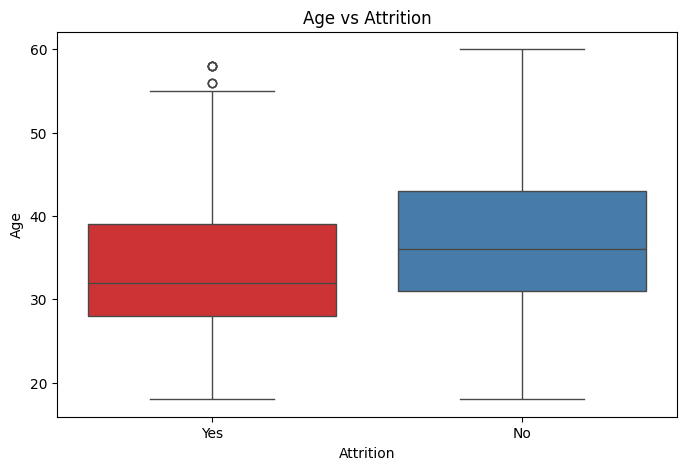
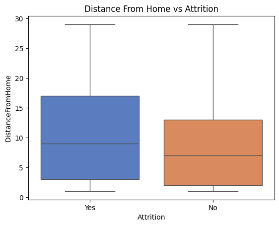

# 📊 Employee Attrition & Overtime Analysis

**📌 Summary:**
This solo hackathon project explores the key factors influencing employee attrition using HR data from IBM. The goal was to identify actionable trends, analyze overtime and job roles, and present findings through interactive Tableau dashboards and Python-based visualizations. Through EDA, modeling, and insight generation, we aimed to support HR in understanding and reducing employee turnover.

This project includes:

* 🧹 A Google Colab notebook for data cleaning, exploration, and visualizations
* 📈 A Tableau dashboard for interactive role-based insights
* 📊 A curated set of visualizations highlighting key attrition patterns
* 💡 Actionable retention strategy proposals based on findings

---

## 📊 Dashboard Overview

Two key Tableau charts were created:

1. **Attrition Rate by Job Role**
   Understand which job roles experience the most attrition.

2. **Overtime Percentage by Job Role**
   Identify roles with the highest average overtime burden.

🔗 [🌐 View Tableau Dashboard on Tableau Public](https://public.tableau.com/views/JobRolevs_AttritionOvertime/JobRolevs_AttritionOvertime?:language=en-GB&publish=yes)

---

## 📓 Google Colab Notebook

The notebook contains the complete analysis pipeline:

🔗 [Open Colab Notebook](https://colab.research.google.com/drive/1l9Ou2U0eoXnIjPtnUG0DH2c65cXslcm3?usp=sharing)

### Included in the notebook:

* Data cleaning & preprocessing
* Exploratory visualizations
* Feature importance ranking (Random Forest)
* Confusion matrix evaluation
* Exported images for GitHub

---

## 📈 Key Insights

* Employees who work overtime are significantly more likely to leave the company.
* Sales Representatives and Lab Technicians have the highest attrition rates.
* Monthly income is lower among employees who left the company.
* Employees with shorter tenure are more likely to quit.
* Job satisfaction scores are lower for those who left, but alone they are not the strongest predictor.
* Distance from home and age also show subtle effects on attrition.

---

## 💼 Retention Strategy Recommendations

### 1. 🔁 Reduce Overtime in High-Risk Roles

* **Insight**: High attrition in roles with above-average overtime (Sales, R\&D).
* **Action**: Limit overtime, rotate shifts, or adjust headcounts in critical teams.

### 2. 🌱 Support Career Development in Sales

* **Insight**: Sales Reps report medium job satisfaction but high attrition.
* **Action**: Provide growth paths, recognition, and internal promotion pipelines.

### 3. 🧘 Improve Work-Life Balance Tracking

* **Insight**: Work-life balance scores impact mid-tier role retention.
* **Action**: Conduct regular surveys, offer hybrid/flex options.

### 4. 🤖 Predictive Monitoring with Key Indicators

* **Insight**: Features like Overtime, Income, and Distance are strong predictors.
* **Action**: Deploy alerting based on risk scores for early HR intervention.

---

## 📊 Key Visualizations

### 🔹 Top 15 Features Predicting Attrition


### 🔹 Attrition by Job Role


### 🔹 Attrition by Overtime


### 🔹 Monthly Income vs Attrition


### 🔹 Years at Company vs Attrition


### 🔹 Job Satisfaction vs Attrition


### 🔹 Age vs Attrition



### 🔹 Distance from Home vs Attrition



### 🔹 Correlation Matrix

.png)

### 🔹 Confusion Matrix


---

## ⚙️ Tools Used

| Tool                      | Purpose                          |
| ------------------------- | -------------------------------- |
| **Python / Google Colab** | Data analysis, modeling, and EDA |
| **Seaborn & Matplotlib**  | Visualization                    |
| **Tableau Public**        | Interactive dashboarding         |

---

## 📁 Project Structure

```
Employee-Attrition-Analysis/
├── README.md                                ← Project overview
├── data_cleaning.ipynb                      ← Google Colab notebook (EDA + charts)
├── dashboard_link.txt                       ← Tableau dashboard link
├── visualizations/                          ← Key images for README
│   ├── Top_Features.png
│   ├── Attrition_by_JobRole.png
│   ├── Attrition_by_Overtime.png
│   ├── Monthly_Income_vs_Attrition.png
│   ├── Years_at_Company_vs_Attrition.png
│   ├── Job_Satisfaction_vs_Attrition.png
│   ├── Distance_from_Home_vs_Attrition.png
│   ├── Age_vs_Attrition.png
│   ├── Correlation_Matrix(Numeric).png
│   └── Confusion_Matrix.png
```

---

## 👩‍💻 Author

**Saule Rubinshtein**
📬 [LinkedIn](https://www.linkedin.com/in/saule-ratautaite)

---
