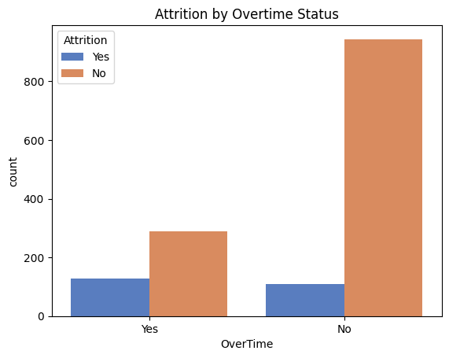

# 📊 Employee Attrition & Overtime Analysis

This project analyzes employee attrition and overtime patterns across job roles using HR analytics data. It includes:

- 🧹 A Google Colab notebook for data cleaning and exploration  
- 📈 A Tableau dashboard for interactive visual insights  

---

## 📊 Dashboard Overview

Two key visualizations were created in Tableau:

1. **Attrition Rate by Job Role**  
   Understand which job roles have the highest and lowest attrition rates.

2. **Overtime Percentage by Job Role**  
   See which job roles are most burdened with overtime work.

🔗 [🌐 View Tableau Dashboard on Tableau Public](https://public.tableau.com/views/JobRolevs_AttritionOvertime/JobRolevs_AttritionOvertime?:language=en-GB&publish=yes)

---

## 📓 Google Colab Notebook

The full data preprocessing, exploratory analysis, and visual chart creation were done in Python using Google Colab. Includes data cleaning, EDA, and chart exports for Tableau.

🔗 [Open Colab Notebook](https://colab.research.google.com/drive/1l9Ou2U0eoXnIjPtnUG0DH2c65cXslcm3?usp=sharing)

The notebook covers:
- Dataset overview and preprocessing
- Handling missing values
- Feature encoding
- Exploratory plots using Seaborn & Matplotlib

---
## 📊 Key Exploratory Charts from Google Colab

#### 🔁 Attrition by Overtime Status
Employees who work overtime are significantly more likely to leave the company.  

#### 💼 Attrition by Job Role
Attrition rates are highest among Sales Executives and Lab Technicians.  

#### 😊 Job Satisfaction vs Attrition
Employees who left generally report lower job satisfaction.  

#### 🛣️ Distance from Home vs Attrition
Those who left tend to live slightly farther from work.  

#### 📊 Age Distribution by Attrition
Younger employees show higher attrition rates — a retention opportunity.  

---

## 🔍 Key Insights

- **Sales Representatives** have the **highest attrition rate (~39.8%)**, despite having average job satisfaction (~2.73).
- **Overtime** is strongly correlated with higher attrition, especially in **Sales** and **R&D** roles.
- **Job satisfaction alone** is not a strong predictor of attrition — overtime and role type play a more significant role.

---
## 📊 Key Visualizations

### 🔹 Top 15 Features Predicting Attrition  

### 🔹 Attrition by Job Role  

### 🔹 Attrition by Overtime  

### 🔹 Monthly Income vs Attrition  

### 🔹 Years at Company vs Attrition  

### 🔹 Job Satisfaction vs Attrition  

---

## 💼 Retention Strategy Recommendations

Based on the patterns uncovered, the following targeted strategies are recommended to reduce attrition:

---

### 1. 🔁 Reduce Overtime in High-Risk Roles
**What we found**: Roles with the highest attrition — especially Sales and Research — also show the highest overtime rates.  
**Why it matters**: Overtime is a strong stressor and linked to employee burnout and eventual resignation.  
**Recommendation**:
- Monitor and limit overtime hours for these roles
- Reassess staffing levels and automate routine tasks
- Schedule mandatory rest windows or rotational shift policies

---

### 2. 🌱 Support Career Development in Sales
**What we found**: Sales Reps have the highest attrition despite decent job satisfaction scores.  
**Why it matters**: Lack of upward mobility or unclear growth paths may drive people to leave even if they’re content day-to-day.  
**Recommendation**:
- Introduce mentorship and coaching programs
- Define clearer promotion and bonus criteria
- Create internal career tracks for Sales talent

---

### 3. 🧘 Enhance Work-Life Balance Monitoring
**What we found**: Work-Life Balance scores have moderate influence on attrition, especially in mid-tier roles.  
**Why it matters**: Poor balance reduces retention and engagement, especially in roles with long commutes or frequent travel.  
**Recommendation**:
- Launch quarterly satisfaction surveys and HR check-ins
- Offer flexible work arrangements (e.g. hybrid, compressed weeks)
- Track satisfaction scores and intervene early if trends decline

---

### 4. 🤖 Use Predictive Indicators for Early Intervention
**What we found**: Our Random Forest model showed features like Overtime, Monthly Income, and Distance from Home were top predictors.  
**Why it matters**: HR can proactively flag at-risk employees before they leave.  
**Recommendation**:
- Build a scoring system based on key predictors
- Set up alerts or HR workflows to review high-risk employees
- Offer personalized retention plans or benefits

---

## ⚙️ Tools Used

| Tool                     | Purpose                               |
|--------------------------|---------------------------------------|
| **Python / Colab**       | Data cleaning and analysis            |
| **Pandas, Seaborn, Matplotlib** | Data visualization and exploration |
| **Tableau Public**       | Interactive dashboard creation        |

---

## 📁 Project Structure

Employee-Attrition-Analysis

├── data_cleaning.ipynb       ← Google Colab notebook (EDA, preprocessing)

├── README.md                 ← This file (project overview, insights & strategy)

├── dashboard_link.txt        ← Tableau Public dashboard (interactive charts)

├── visualizations/                          ← Folder containing all key visual charts

---

## 👩‍💻 Author

**Saule Rubinshtein**  
📬 Contact: www.linkedin.com/in/saule-ratautaite
